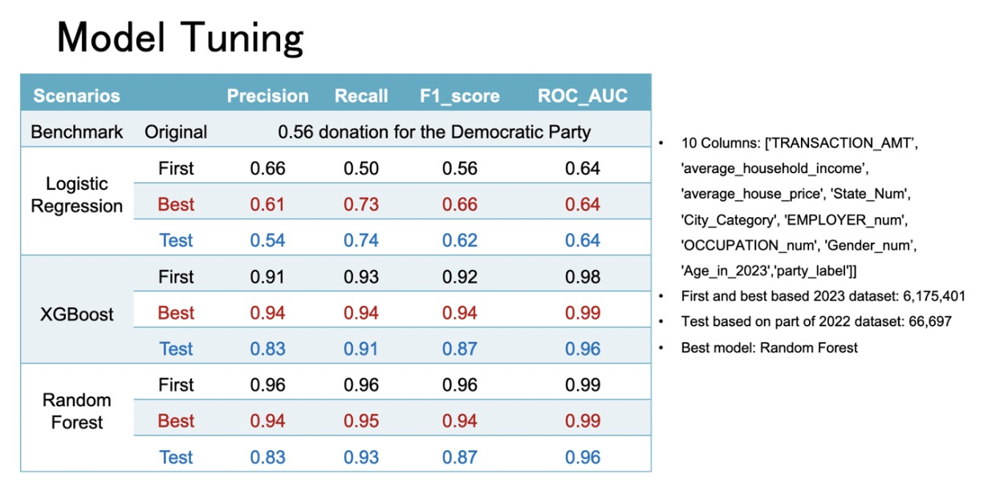

# Political Data Analysis Projects

## Donor / Customer Detector

### Overview
Developed a robust Donor Detector model to aid political fundraisers in accurately identifying potential donors and optimizing the donation acquisition process. The model was trained on a comprehensive dataset of 6.5 million donors, implementing various data preprocessing and machine learning techniques.

### Data Preprocessing
- Organized and cleaned the dataset.
- Transformed data using label encoding, frequency encoding, and one-hot encoding.

### Exploratory Data Analysis (EDA)
- Conducted thorough EDA to understand the underlying patterns within the data.
- Generated new features with domain knowledge.

### Model Development
- Built binary classification models including Logistic Regression, Random Forest, XGBoost, and SVM.
- Random Forest emerged as the best performing model with a precision of 0.90 and ROC-AUC of 0.93.

### Business Impact
- The model's precision was boosted from 56% to 90%, marking a 60% increase.
- This enhancement has the potential to add $126 million in annual donations.

### Deployment
- The model was wrapped as an API using Flask and deployed on Google Cloud Platform (GCP).

## Political Funding Forecasting

### Overview
This project involved creating a time series-based funding trend model to assist political organizations with budget planning for fundraising activities. The model utilized election data spanning from 2016 to 2022 obtained from the Federal Election Commission.

### Data Organization
- Segmented data into yearly, monthly, and weekly formats.
- Focused on weekly trends and addressed missing values by removing NaN entries.

### Model Testing
- Evaluated Linear Regression, ARIMA, and SARIMA models.
- Achieved a notable R2 score of 36.7% with Linear Regression, suggesting the model's effectiveness in capturing the variance of the data.

---

This repository documents the methodologies, outcomes, and the analytical approach taken in the above projects. For more details on the models and their implementations, please refer to the code and documentation provided within each project directory.
